<!-- Limit image width and height for all images -->
<style type='text/css'>
img {
    max-height: 400px;
}
</style>
<style>
table, th, td {
    border: 1px solid black;
}
</style>

<!-- Center image on slide -->
<script src="http://ajax.aspnetcdn.com/ajax/jQuery/jquery-1.7.min.js"></script>
<script type='text/javascript'>
$(function() {
    $("p:has(img)").addClass('centered');
});
</script>
<style>
em {
  font-style: italic
}
</style>

## Part 1: Theoretical Machine Learning

Machine learning:
* Takes knowledge as input
* Receives parameter settings
* ??? (Magic)
* Produces knowledge as output

> A machine learning system is a function $L$ that, given some input knowledge $I \in \mathcal{I}$ and parameter settings $p \in P$, produces an output called a model or hypothesis $O \in \mathcal{O}$: $$\mathcal{L}: \mathcal{I} \times \mathcal{P} \rightarrow \mathcal{O}$$


**BUT FIRST... Get to know your data!**

It is bad practice to apply machine learning on a dataset you don't know!

--- 

## Before Machine Learning

Generally, these are the steps you should take:

1. Get data
2. Clean and/or anonymize data
3. Explore data:
     * What is in it?
     * What is useful? (Any of it? Anonymized beyond recognition?)
     * Does it need more cleaning?
4. Apply statistical methods:
     * What are the trends in your data?
     * What is normal behaviour and what is outlier behaviour?
5. Fit simple models, eg. regression model
6. Finally: **apply machine learning algorithms!**
7. Evaluate, repeat if needed

--- &twocoltopbottom7030

## Steps 1-2: Getting and Cleaning Data

Often, *useful* data is hard to come by
* **Option 1:** work with what you have
     * Problem: garbage in, garbage out
* **Option 2:** get better data
     * Problem: not always possible
*** =left
Maybe, we can salvage something from the provided dataset:
* Data manipulation - **[R package] dplyr**
* Data grouping and chaining - **[R package] dplyr**
* Tidying data - **[R package] tidyr**
* Assemble dates and times - **[R package] lubridate**

*** =right
<div style='text-align: center;'>
    
</div>

--- &twocoltopbottom8020
## R Package: dplyr
*** =left
* Data manipulation:
     * *select():* take out some columns
     * *filter():* take out some rows
     * *arrange():* order rows by column value
     * *mutate():* create column from other column value
     * *summarize():* collapse data using a function, eg. mean()
*** =right
<div style='text-align: center;'>
    
</div>
*** =bottom
* Data grouping and chaining:
     * *group_by():* break dataset into groups based on column value
     * *summarize()* on data grouped by *group_by()*
     * *%>%*: chaining operator to chain execution of dplyr commands

---

## Data Manipulation with dplyr: *select()* Example


Example dataset (R package download logs from CRAN for 1 day, $\pm$ 225,000 rows):

```
##   X       date     time   size r_version r_arch      r_os   package version country ip_id
## 1 1 2014-07-08 00:54:41  80589     3.1.0 x86_64   mingw32 htmltools   0.2.4      US     1
## 2 2 2014-07-08 00:59:53 321767     3.1.0 x86_64   mingw32   tseries 0.10-32      US     2
## 3 3 2014-07-08 00:47:13 748063     3.1.0 x86_64 linux-gnu     party  1.0-15      US     3
```
* Load into dplyr, *select()* some of the columns we're interested in:

```r
cranShort <- select(cran, size:version) # Select columns size through version
```

```
##     size r_version r_arch      r_os   package version
## 1  80589     3.1.0 x86_64   mingw32 htmltools   0.2.4
## 2 321767     3.1.0 x86_64   mingw32   tseries 0.10-32
## 3 748063     3.1.0 x86_64 linux-gnu     party  1.0-15
## 4 606104     3.1.0 x86_64 linux-gnu     Hmisc  3.14-4
```

---

## Data Manipulation with dplyr: *filter()* Example
* *filter()* is like *select()*, but it takes rows instead of columns
* Let's take the rows for the *'dplyr'* package downloads:

```r
filter(cranShort, package =='dplyr') # Retain only rows for package dplyr
```

```
##     size r_version r_arch         r_os package version
## 1 591176     3.0.3 x86_64      mingw32   dplyr     0.2
## 2 591176     3.1.0 x86_64    linux-gnu   dplyr     0.2
## 3 591178     3.1.0 x86_64      mingw32   dplyr     0.2
## 4 591179     3.1.0   i386      mingw32   dplyr     0.2
## 5 591176     3.0.2 x86_64    linux-gnu   dplyr     0.2
## 6 591178     3.0.2 x86_64 darwin10.8.0   dplyr     0.2
```

* Useful *filter()* trick: remove rows with NA's ( = missing values):

```r
filter(cranShort, !is.na(r_version)) # Filters out rows where r_version is NA
```

---

## Data Manipulation with dplyr: *arrange()* Example
* Order rows of a dataset by column value: *arrange()*
* Let's use it to order the data by package size:


```r
arrange(cranShort, size) # Order dataset by size column
```

```
##   size r_version r_arch r_os package version
## 1  512      <NA>   <NA> <NA> ellipse   0.3-8
## 2  513      <NA>   <NA> <NA>   class  7.3-10
```
* The same in descending order:


```r
arrange(cranShort, desc(size)) # Order dataset by size column
```

```
##       size r_version r_arch    r_os               package version
## 1 62559635     3.0.3 x86_64 mingw32 ChemometricsWithRData   0.1.3
## 2 62559246     3.0.3 x86_64 mingw32 ChemometricsWithRData   0.1.3
## 3 62553483     3.1.0   i386 mingw32 ChemometricsWithRData   0.1.3
```

---

## Data Manipulation with dplyr: *mutate()* Example
* Create new columns out of (combinations of) other columns: *mutate()*
* Eg. convert size column, now in bytes, to megabytes and gigabytes:


```r
# Create column of size in MB and GB
mutate(cranShort, size_mb = size / 2^20, size_gb = size_mb / 2^10)
```

```
##     size r_version r_arch      r_os      package version    size_mb      size_gb
## 1  80589     3.1.0 x86_64   mingw32    htmltools   0.2.4 0.07685566 7.505435e-05
## 2 321767     3.1.0 x86_64   mingw32      tseries 0.10-32 0.30686092 2.996689e-04
## 3 748063     3.1.0 x86_64 linux-gnu        party  1.0-15 0.71340847 6.966880e-04
## 4 606104     3.1.0 x86_64 linux-gnu        Hmisc  3.14-4 0.57802582 5.644783e-04
## 5  79825     3.0.2 x86_64 linux-gnu       digest   0.6.4 0.07612705 7.434282e-05
## 6  77681     3.1.0 x86_64 linux-gnu randomForest   4.6-7 0.07408237 7.234607e-05
## 7 393754     3.1.0 x86_64 linux-gnu         plyr   1.8.1 0.37551308 3.667120e-04
```

--- 

## Data Manipulation with dplyr: *summarize()* Example
* *summarize()* can be used to collapse the dataset using a function
* Let's do this using the mean package size:


```r
summarize(cran, avg_bytes = mean(size)) # Show the mean of the size column
```

```
##   avg_bytes
## 1  844086.5
```
* Not very interesting ... yet

---

## Data Grouping with dplyr: *group_by()* Example
* Break the dataset into groups based on column value: *group_by()*
* Eg. grouping on the *'package'* column:


```r
group_by(cranShort, package)
```

```
## Source: local data frame [3 x 6]
## Groups: package [3]
## 
##     size r_version r_arch      r_os   package version
##    (int)     (chr)  (chr)     (chr)     (chr)   (chr)
## 1  80589     3.1.0 x86_64   mingw32 htmltools   0.2.4
## 2 321767     3.1.0 x86_64   mingw32   tseries 0.10-32
## 3 748063     3.1.0 x86_64 linux-gnu     party  1.0-15
```
* 'Groups: package' implies a grouping by package occurred, all else is unchanged 
* **Any operation we apply to the grouped data will take place on a per package basis!**

---

## Data Grouping with dplyr: *summarize()* Example
* Any operation applied to grouped data takes place on a per group basis
* Let's try *summarize()* again, but on grouped data:


```r
summarize(group_by(cranShort, package), avg_bytes = mean(size))
```

```
##       package  avg_bytes
## 1          A3   62194.96
## 2         abc 4826665.00
## 3    abcdeFBA  455979.87
## 4 ABCExtremes   22904.33
## 5    ABCoptim   17807.25
## 6       ABCp2   30473.33
```
Instead of a single value, *summarize()* now returned the mean size for each package!

---

## Data Chaining with dplyr: Chaining Operator *%>%*
* Chaining operator is syntactic sugar - no added value apart from cleaner code 
* Format: *dataset %>% function(args) %>% morefunctions(args)*


```r
cran %>% select(ip_id, country, package, size) %>% # select some columns
     mutate(size_mb = size / 2^20) %>% # create the size in MB column
     filter(size_mb <= 0.5) %>% # filter on the created column
     arrange(desc(size_mb)) %>% # order in descending order
     head(3) # take only first 3 rows
```

```
## Source: local data frame [3 x 5]
## 
##   ip_id country package   size   size_mb
##   (int)   (chr)   (chr)  (int)     (dbl)
## 1 11034      DE    phia 524232 0.4999466
## 2  9643      US     tis 524152 0.4998703
## 3  1542      IN RcppSMC 524060 0.4997826
```

---
## Tidy vs. Messy Data
* Principles of tidy data:
     * Each variable forms a column
     * Each observation forms a row
     * Each type of observational unit forms a table
* If the above is not satisfied, data is 'messy', and needs cleaning
* Most common symptoms of messy data: 
     1. Column headers are values, not variable names
     2. Multiple variables are stored in one column
     3. Variables are stored in both rows and columns
     4. Multiple types of observational units are stored in the same table
     5. A single observational unit is stored in multiple tables
* Solution: **[R package] tidyr**

--- &twocoltopbottom8020
## R Package: tidyr
*** =left
Data cleaning functions:
* *gather()*: collapses columns into key-value pairs
     * Used when some columns are not variables (\#1)
* *separate()*: splits column values into multiple columns
     * Used when a column contains more than one variable (\#2)
     
*** =right
<div style='text-align: center;'>
    
</div>

*** =bottom
* *spread()*: spreads a key-value pair across multiple columns
     * Used when variables are stored in both rows and columns (\#3)
* *select()*: keeps only the variables listed
     * Used when multiple types of observational units are stored together (\#4)
* *bind_rows()*: bind multiple tables by row
     * Used when a single observational unit is stored in multiple tables (\#5)
     

---

## Tidying Data with tidyr: fixing \#1 with *gather()*
\#1: Column headers are values, not variable names, eg.:

```
##   grade male female
## 1     A    1      6
## 2     B    5      2
```
Column names should be: grade, gender, count

```r
gather(students,gender,count,-grade) # gather all columns except grade (already exists)
```

```
##   grade gender count
## 1     A   male     1
## 2     B   male     5
## 3     A female     6
## 4     B female     2
```

---

## Tidying Data with tidyr: fixing \#2 with *separate()*
\#2: Multiple variables are stored in one column, eg.:

```
##   grade gender_class count
## 1     A       male_1     1
## 2     A     female_1     2
## 3     A       male_2     3
## 4     A     female_2     4
```
Data from two classes listed in one columns, need to be separated:


```r
separate(students2,col=gender_class,into=c("gender","class")) # separate into two columns
```

```
##   grade gender class count
## 1     A   male     1     1
## 2     A female     1     2
## 3     A   male     2     3
## 4     A female     2     4
```

---

## Tidying Data with tidyr: fixing \#3 with *spread()*
\#3: Variables are stored in both rows and columns, eg.:

```
##    name    test grade
## 1 Sally midterm     A
## 2 Sally   final     C
## 3  Jeff midterm     B
## 4  Jeff   final     A
```
The test column values should be columns:


```r
spread(students3,test,grade) # turn test column values into column names containing grade
```

```
##    name final midterm
## 1  Jeff     A       B
## 2 Sally     C       A
```

--- &twocoltopbottom

## Tidying Data with tidyr: fixing \#4 with *select()*
\#4: Multiple types of observational units are stored in the same table, eg.:


```
##    id  name gender class midterm final
## 1 588 Sally      F CS101       A     B
## 2 588 Sally      F CS201       C     B
## 3 710  Jeff      M CS101       B     A
```
This looks ok? ... But id, name and gender are repeated - redundancy is bad. <br>
$\rightarrow$ Split into two tables with select - keep id column in both as primary key:

*** =left

```r
select(s4,id,class,midterm,final)
```

```
##    id class midterm final
## 1 588 CS101       A     B
## 2 588 CS201       C     B
## 3 710 CS101       B     A
```

*** =right

```r
unique(select(s4,id,name,gender))
```

```
##    id  name gender
## 1 588 Sally      F
## 3 710  Jeff      M
```

--- &twocoltopbottom

## Tidying Data with tidyr: fixing \#5 with *bind_rows()*
\#5: A single observational unit is stored in multiple tables, eg. tables "passed" and "failed":


*** =left

```
##    name class grade
## 1 Sally CS101     A
## 2  Jeff CS201     A
```

*** =right

```
##    name class grade
## 1 Brian CS101     E
## 2 Kathy CS201     D
```

*** =bottom
We really want to combine "passed" and "failed" into a single table, with the name of the original table as a new variable:


```r
passed <- mutate(passed,status='passed'); failed <- mutate(failed,status='failed')
data.frame(bind_rows(passed,failed)) # combine the tables into a single table
```

```
##    name class grade status
## 1 Sally CS101     A passed
## 2  Jeff CS201     A passed
## 3 Brian CS101     E failed
## 4 Kathy CS201     D failed
```

--- &twocoltopbottom8020
## R Package: lubridate
*** =left
* Date functions:
     * *today()*: current date
     * *year()*, *month()*, *day()*
* Time functions:
     * *now()*: current date and time
     * *hour()*, *minute()*, *second()*
     
*** =right
<div style='text-align: center;'>
    
</div>

*** =bottom
* Datetime functions:
     * Parsing datetimes: *ymd()*, *dmy()*, *hms()*, *ymd_hms()*, etc.
     * Allows use of arithmetic operators on dates and times, eg. *now()* + *days(2)*
     * *with_tz():* timezone conversion
     * *interval(time1,time2):* returns how much time there is between given datetimes
     * *stopwatch():* start timer until the next use of *stopwatch()*


--- 

## Recall.. Before Machine Learning

Recall the steps you should take:

1. ~~Get data~~
2. ~~Clean and/or anonymize data~~
3. **Explore data:**
     * **What is in it?**
     * **What is useful? (Any of it? Anonymized beyond recognition?)**
     * **Does it need more cleaning?**
4. Apply statistical methods:
     * What are the trends in your data?
     * What is normal behaviour and what is outlier behaviour?
5. Fit simple models, eg. regression model
6. Apply machine learning algorithms
7. Evaluate, repeat if needed

--- &twocoltopbottom
## Step 3: Exploratory Data Analysis (EDA)

*** =left
<br>

<div style='text-align: center;'>
    
</div>
*** =right
<br>

> "Exploratory data analysis is an approach to analyzing data sets to summarize their main characteristics, often with visual methods."


* Arguably one of the most important aspects of data analysis!
* Often, but not always, through visualizations
* No true "best practice"
* Try things out, look at it, change it
* R is excellent for it


---
## Exploratory Data Analysis in R
R has three famous plotting systems:
* Base (comes with base R install)
* Lattice (Package)
* Ggplot2 (Package)

<br>

All have their use, but we will focus on ggplot2:
* Based on the "Grammar of Graphics (GG)"
* Easy to use, intuitive
* Nice looking graphs
* Pretty defaults, but still customizable

--- &twocoltopbottom8020
## Exploratory Data Analysis with ggplot2
*** =left
* Plotting in ggplot2 always starts with one of two functions: 
     * *qplot()* (basic workhorse)
     * *ggplot()* (more customization)
     
* Next, you add the components or building blocks you want:
     * colour
     * shape
     * size
     * geometric objects (points, lines, bars, ...)
     * legend
     * etc.
     
*** =right
<div style='text-align: center;'>
    
</div>

---
## Exploratory Data Analysis with qplot()

Very simple scatterplot:

```r
qplot(displ,hwy,data=mpg)
```

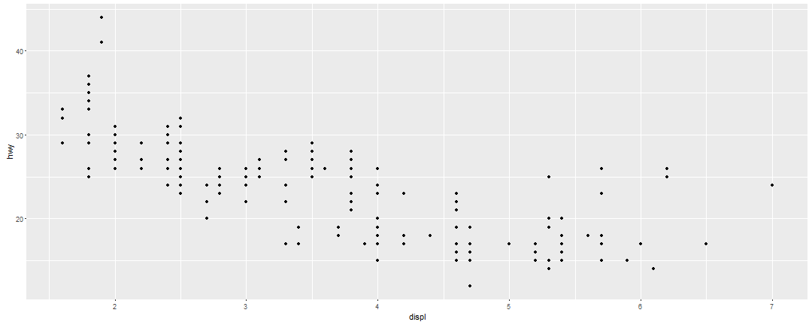

---
## Exploratory Data Analysis with qplot()
Add some colour based on a factor variable by using an aesthetic:

```r
qplot(displ,hwy,data=mpg,color=drv)
```


---
## Exploratory Data Analysis with qplot()
Add a smoothing function:

```r
qplot(displ,hwy,data=mpg,color=drv,geom=c("point","smooth"))
```


---
## Exploratory Data Analysis with qplot()
Boxplot of the same data:

```r
qplot(drv,hwy,data=mpg,geom="boxplot")
```


---
## Exploratory Data Analysis with qplot()
Add a colour based on a factor variable:

```r
qplot(drv,hwy,data=mpg,geom="boxplot",color=manufacturer)
```


---
## Exploratory Data Analysis with qplot()
Histogram of the same data, with a fill colour:

```r
qplot(hwy,data=mpg,fill=drv)
```


---
## Exploratory Data Analysis with qplot()
To get a faceted plot, add argument facets with the desired formula as *rows ~ columns*:

```r
qplot(displ,hwy,data=mpg,facets=.~drv)
```

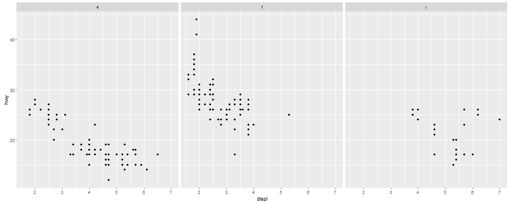

---
## Exploratory Data Analysis with qplot()
To get the facets as rows:

```r
qplot(hwy,data=mpg,facets=drv~.)
```

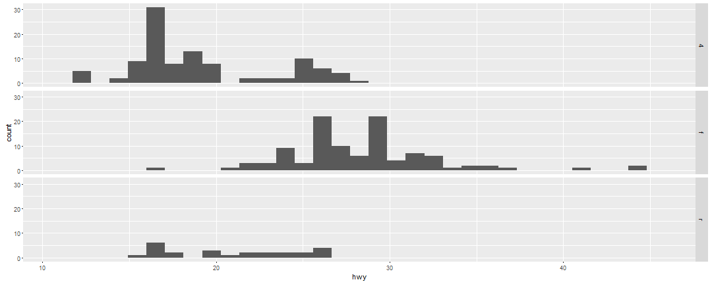

---
## Exploratory Data Analysis with qplot()
Final example combining all of the above:

```r
qplot(displ,hwy,data=mpg,geom=c("point","smooth"),facets=.~drv)
```


---
## Exploratory Data Analysis with ggplot2
Before we have a look at the more customizable *ggplot()* function, we review the most important potential building blocks the package offers us:
* **Aesthetic mappings *(aes)*:** determine how data are mapped to color, size, etc.
* **Geometric objects *(geoms)*:** what you see in the plot (points, lines, shapes)
* **Facets *(facets)*:** the panels in panel plots

There are three more, taken care of for you by *qplot()*, but customizable in *ggplot()*:
* **Statistical transformations *(stats)*:** binning, quantiles, smoothing, ...
* **Scales:** the encoding of aesthetic mappings, eg. male = red, female = blue
* **Coordinate system**

<br>

**If you don't want to edit these: stick to *qplot()*, *ggplot()* is much more verbose!**

---
## Exploratory Data Analysis with ggplot()
Just a quick ggplot example (as you see, more verbose):

```r
ggplot(mtcars,aes(factor(am),mpg)) +
     geom_boxplot(width=.6,aes(fill=factor(am,labels=c("Automatic","Manual")))) +
     labs(title="Boxplot of Miles per Gallon vs. Transmission Type") +
     ylab("Miles per Gallon (MPG)") + xlab("Transmission\nType\n") +
     scale_x_discrete(labels=c("0" = "Automatic", "1" = "Manual")) +
     scale_fill_manual("Transmission Type",values=c("Darkblue","steelblue")) +
     coord_flip()
```


---
## Quiz 5: Data Cleaning and Exploration

# https://goo.gl/KwL76T

--- 

## Recall.. Before Machine Learning

Recall the steps you should take:

1. ~~Get data~~
2. ~~Clean and/or anonymize data~~
3. ~~Explore data~~
4. ~~Apply statistical methods~~
5. ~~Fit simple models, eg. regression model~~
6. **Apply machine learning algorithms**
7. Evaluate, repeat if needed

---
## Machine Learning Basics
There are several classes of machine learning algorithms:
* Supervised learning
* Unsupervised learning
* Semi-supervised learning

<br>

Whether or not an algorithm is supervised depends on whether or not it requires the *training set* to be *labeled* to create a *model*.
* **Training set:** the data used to train a machine learning model
* **Label:** the "correct" answer for a training case
* **Model:** the output of a machine learning algorithm, used to predict

---
## Training, Testing and Validation Set
* **Training set:** A machine learning algorithm needs *training data* to create a model
     * Supervised: all data must be labeled
     * Unsupervised: labels not needed, allowed but not used
     * Semi-supervised: some labeled data needed
* **Validation set:** 
     * Repeated tests with the same data leads to overfitting
     * Overfitting = tuning our model too much towards the data, not generalizable
     * Thus, intermediate testing is done with *validation data*
     * Label requirements are as above for evaluation purposes
* **Testing set:** To evaluate a finished model, we need *testing data*
     * Label requirements are as above for evaluation purposes
     * In competitions, you will NOT have these labels - they are used for scoring!

---
## Training, Testing and Validation Set in R
* To split into training/testing/validation sets: 
     * *caret* package
     * *createDataPartition()* function
* Code example:


```r
# load the iris dataset
data(iris) 

# define an 80%/20% train/test split of the dataset
trainIndex <- createDataPartition(iris$Species,p=0.80,list=FALSE)
data_train <- iris[trainIndex,] ; data_test <- iris[-trainIndex,]

# define a 60%/40% train/validation split on the remaining training data
trainIndex <- createDataPartition(iris$Species,p=0.60,list=FALSE)
data_train <- iris[trainIndex,] ; data_valid <- iris[-trainIndex,]
```

---
## Types of Learning Tasks
Machine learning algorithms have many uses, but mainly:
* **Classification:** assigning a category to a given observation
     * Eg. classify email as "spam" or "non-spam"
     * Output: the assigned class
* **Regression:** model the continuous phenomenon that generated the input data
     * Eg. model the relation between gas-mileage and transmission type
     * Output: the model, evaluated in a given point
* **Forecasting:** generate various predictions, representing what
might happen over non-specific time-periods in the future
     * Eg. model the weather for the coming week
     * Output: multiple predicted possibilities

---
## Machine Learning Algorithms: Overview
List of popular (types of) machine learning algorithms:
* Decision trees (DT)
* Random forests (RF)
* Rule set learning, aka association rule learning
* Probabilistic models, eg. Bayesian inference
* Instance based learning (IBL)
* Artificial neural networks (ANN)
* Support vector machines (SVMs)
* Clustering
     * K-Means clustering
     * Hierarchical clustering

---
## Before We Start... R Package: caret
Very useful R package for machine learning: *caret*, contains tools for:
* Data splitting
* Pre-processing
* Feature selection
* Model tuning using resampling
* Variable importance estimation
* etc.

<div style='text-align: center;'>
    
</div>

--- &twocoltopbottom
## Decision Trees

*** =left
* Supervised learning, labels needed
* Very popular
* Tree-shaped flowchart structure
     * Good prediction accuracy
     * High interpretability

<br>

> **Usage**: Starting at the root of the tree, a path is constructed to a leaf by computing in each internal node the outcome of its associated test for input *x*, and following the outgoing edge labeled with that outcome, until a leaf is reached. The value *y* stored in that leaf is the value to which *x* is mapped by the tree.

*** =right
**Example decision tree: rain tomorrow?**


---&twocoltopbottom
## Decision Trees in R with caret

* Train a model using "rpart" (the original decision tree package)
* First argument is of form *y ~ x*, here: predict "Species" using all other variables, written "."


```r
model <- train(Species ~ ., data = iris, method = "rpart")
```

*** =left

```r
plot(model$finalModel)
text(model$finalModel)
```
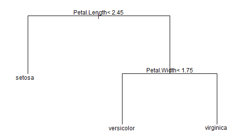

*** =right

```r
fancyRpartPlot(model$finalModel, 
             palettes=c('Greys','Oranges'))
```


--- &twocoltopbottom
## Support Vector Machines (SVMs)

*** =left
* Supervised learning, labels needed
* Models represent data as points in space
* Different labels should be separated by a gap
* Which side of gap new points are on is used to predict category

Example SVM for linearly separable features:

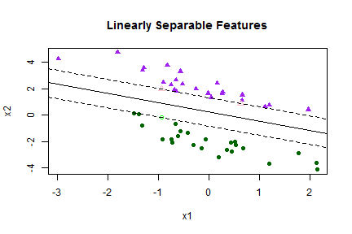

*** =right

If not separable in linear space, map to higher dimension:


--- &twocoltopbottom
## More Examples: What Type of Flower?

*** =left 
**Predicted class:**
* Predict class of iris flower


*** =right 
**Prediction confidence:**
* How certain are these predictions?


--- &twocol
## SVMs in R with caret
*** =left
Given this randomly generated data:
* Train a model using "svmLinear", "svmPoly" or "svmRadial", ...
* First argument is of form *y ~ x*
* Here we use: *y ~ .* where "." represents "all available x"


*** =right
**Linear SVM attempt**

```r
mL <- train(y~.,data=dat,method="svmLinear")
plot(mL$finalModel)
```
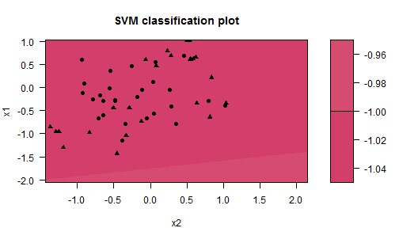

* **Accuracy:** 0.8
* Reason: more red than blue - **Beware!**

--- &twocoltopbottom
## SVMs in R with caret

*** =left
**Polynomial SVM attempt**

```r
mP <- train(y~.,data=dat,method="svmPoly")
plot(mP$finalModel)
```


**Accuracy:** 0.9272727
*** =right
**Radial SVM attempt**

```r
mR <- train(y~.,data=dat,method="svmRadial")
plot(mR$finalModel)
```


**Accuracy:** 0.9454545

--- &twocoltopbottom
## Clustering

*** =left
* Unsupervised learning, NO labels needed
* Grouping data into categories based on some measure of distance or similarity
* Two famous types:
     * K-means clustering
     * Hierarchical clustering
* Visualization #1: **dendrogram**

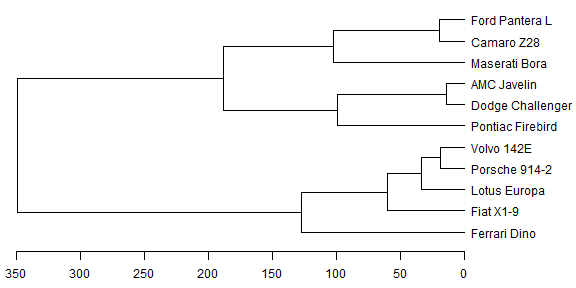


*** =right
* Visualization #2: **Heatmap** (with/without the added dendrogram)


---
## Clustering Heatmap Explanation


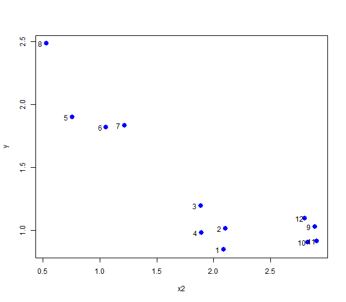

---
## Clustering Heatmap Explanation


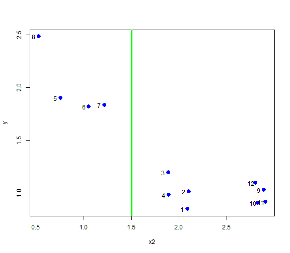

---
## Clustering Heatmap Explanation


---
## Clustering Heatmap Explanation

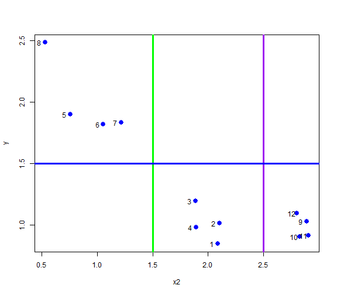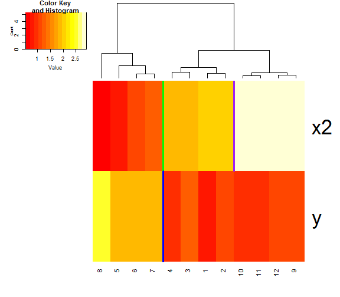

---
## Hierarchical Clustering Example


```r
distanceMatrix <- dist(dataFrame) # compute distance matrix
hc <- hclust(distanceMatrix) # cluster based on calculated distances
```


--- &twocoltopbottom
## Hierarchical Clustering Example


*** =left
* Cutoff at distance 1.5
     * Intersects 3 lines in dendrogram
     * # clusters at this distance: 3

--- &twocoltopbottom
## Hierarchical Clustering Example


*** =left
* Cutoff at distance 1.5
     * Intersects 3 lines in dendrogram
     * # clusters at this distance: 3
*** =right


```r
cutree(hc, h = 1.5) # cut at height 1.5
```

```
## 1 1 1 1 2 2 2 2 3 3 3 3
```

--- &twocoltopbottom
## Hierarchical Clustering Example

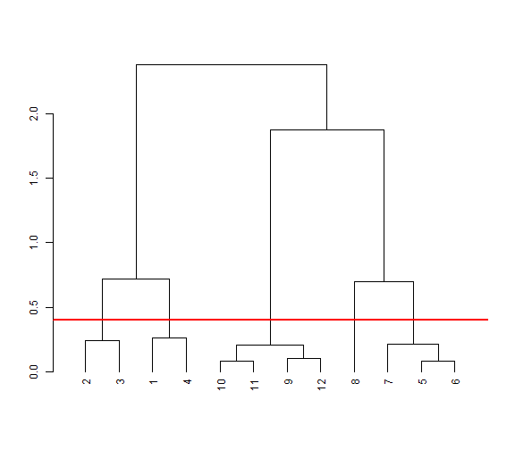
***=left
* Cutoff at distance 0.4
     * Intersects 5 lines in dendrogram
     * # clusters at this distance: 5

--- &twocoltopbottom
## Hierarchical Clustering Example

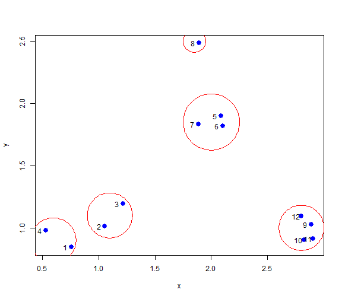
***=left
* Cutoff at distance 0.4
     * Intersects 5 lines in dendrogram
     * # clusters at this distance: 5
*** =right


```r
cutree(hc, h = 0.4) # cut at height 0.4
```

```
## 1 2 2 1 3 3 3 4 5 5 5 5
```

--- &twocoltopbottom
## Hierarchical Clustering Example


*** =left
* Cutoff at distance 0.05
     * Intersects all 12 lines in dendrogram
     * # clusters at this distance: 12

--- &twocoltopbottom
## Hierarchical Clustering Example

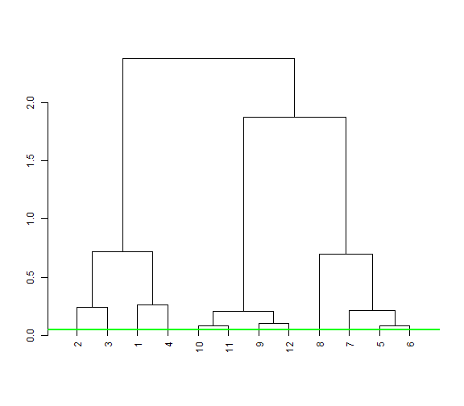
*** =left
* Cutoff at distance 0.05
     * Intersects all 12 lines in dendrogram
     * # clusters at this distance: 12
*** =right


```r
cutree(hc, h = 0.05) # cut at height 0.05
```

```
## 1 2 3 4 5 6 7 8 9 10 11 12
```

---
## K-Means Clustering Example


* Assumed number of clusters: 3
* Calculate cluster centroids (= element representing center)

---
## K-Means Clustering Example

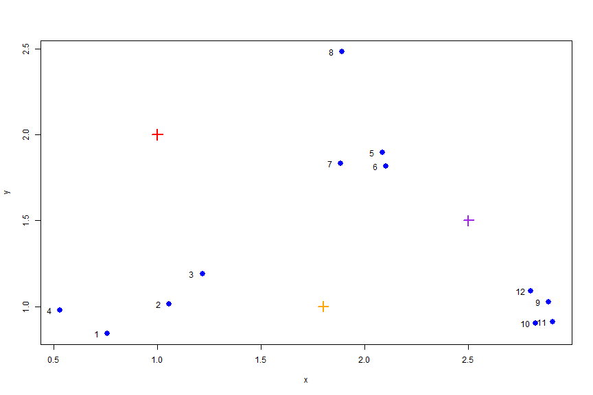

* Cluster assignments based on minimal distance to centroids:


|            |1      |2      |3      |4   |5      |6      |7      |8   |9      |10     |11     |12     |
|:-----------|:------|:------|:------|:---|:------|:------|:------|:---|:------|:------|:------|:------|
|New_Cluster |orange |orange |orange |red |purple |purple |purple |red |purple |purple |purple |purple |

---
## K-Means Clustering Example

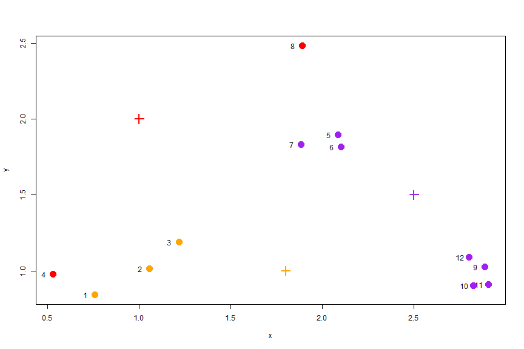

* **Next:** recalculate cluster centroids

---
## K-Means Clustering Example

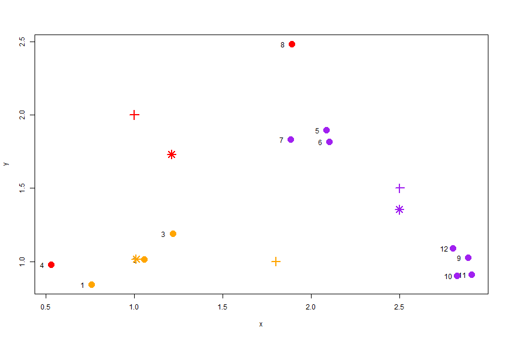


* Cluster assignments based on minimal distance to centroids:


|            |1      |2      |3      |4      |5      |6      |7   |8   |9      |10     |11     |12     |
|:-----------|:------|:------|:------|:------|:------|:------|:---|:---|:------|:------|:------|:------|
|New_Cluster |orange |orange |orange |orange |purple |purple |red |red |purple |purple |purple |purple |

---
## K-Means Clustering Example


* **Next:** recalculate cluster centroids

---
## K-Means Clustering Example

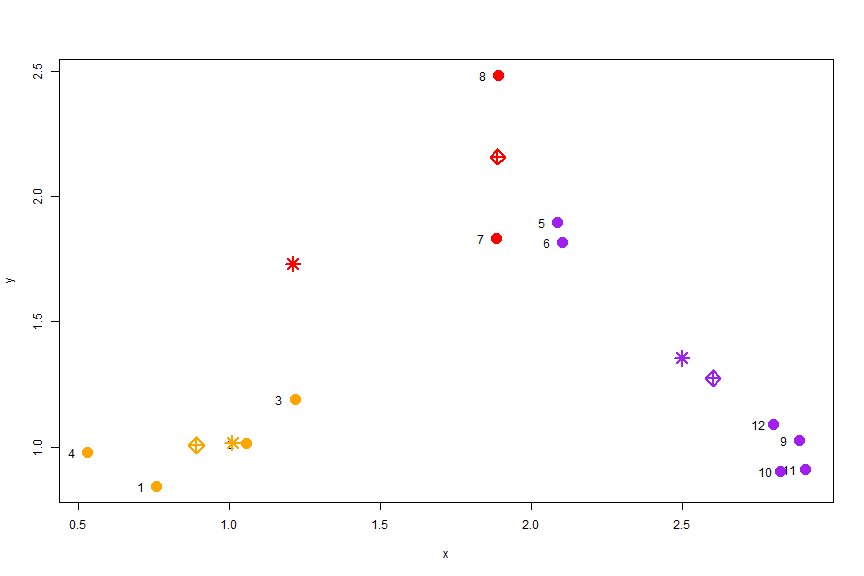


* Cluster assignments based on minimal distance to centroids:


|            |1      |2      |3      |4      |5   |6   |7   |8   |9      |10     |11     |12     |
|:-----------|:------|:------|:------|:------|:---|:---|:---|:---|:------|:------|:------|:------|
|New_Cluster |orange |orange |orange |orange |red |red |red |red |purple |purple |purple |purple |

---
## K-Means Clustering Example

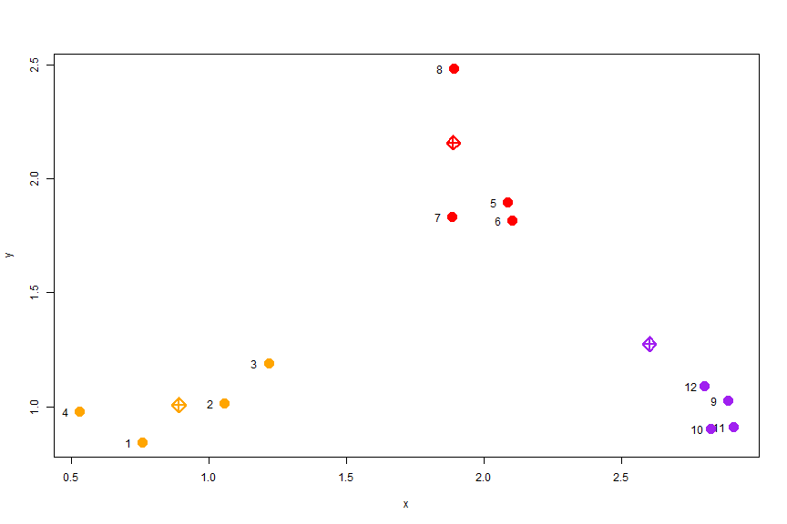

**No more points would change cluster: we are done!**


--- 

## Data Science Step-by-Step

Recall the steps you should take:

1. ~~Get data~~
2. ~~Clean and/or anonymize data~~
3. ~~Explore data~~
4. ~~Apply statistical methods~~
5. ~~Fit simple models, eg. regression model~~
6. ~~Apply machine learning algorithms~~
7. **Evaluate, repeat if needed**

--- &twocoltopbottom
## Evaluation and Comparison of ML Models
*** =left
**Classification output: class label**
* Either correct or incorrect
* Common evaluation metrics:
     * Accuracy: % correct
          * Confidence intervals
          * P-values
     * True/False Positive/Negative Rate
     * Confidence matrix
     * Visual:
          * Heatmap of confidence matrix
          * Variable importance plots
          * ROC curves

*** =right
**Regression output: continuous number**
* Closer to real value = better
* Common evaluation metrics:
     * Residuals: what model doesn't explain
     * (Adjusted) R-squared: goodness-of-fit
     * Standard Error
     * Correlation with real value
     * Visual:
          * Residual plots
          * Variable importance plots

---
## Evaluating Classification in R: Accuracy
* We use caret: *confusionMatrix()*
* Accuracy best estimated on a validation/test set, eg:


```r
data(iris) # load the iris dataset
# define an 80%/20% train/test split of the dataset
trainIndex <- createDataPartition(iris$Species, p=0.80, list=FALSE)
data_train <- iris[trainIndex,] ; data_test <- iris[-trainIndex,]
model <- train(Species~., data=data_train, method='rpart') # train a model, eg. a decision tree
predictions <- predict(model, data_test[,1:4]) # make predictions
cm <- confusionMatrix(predictions, data_test$Species) # summarize results
cm$overall
```

```
##       Accuracy          Kappa  AccuracyLower  AccuracyUpper   AccuracyNull 
##   9.000000e-01   8.500000e-01   7.347115e-01   9.788829e-01   3.333333e-01 
## AccuracyPValue  McnemarPValue 
##   1.665006e-10            NaN
```

--- &twocoltopbottom
## Evaluating Classification in R: Confusion Matrix

*** =left
* We use caret: *confusionMatrix()*
* **Confusion matrix of course also in here:**


```r
cm <- confusionMatrix(predictions, 
                      data_test$Species)
cm$table
```

```
##             Reference
## Prediction   setosa versicolor virginica
##   setosa         10          0         0
##   versicolor      0         10         3
##   virginica       0          0         7
```

*** =right
* **Heatmap visualization:**


---
## Evaluating Classification in R: Variable Importance
* Variable Importance Plot "VarImpPlot"
* To evaluate model features' importance
     * Top right: most important - bottom left: least important
* In R: *randomForest* package, *varImpPlot()* function


```r
varImpPlot(classModel)
```


--- &twocoltopbottom7030
## Evaluating Classification in R: Evaluation Metrics
*** =left
<br>
<div style='text-align: center;'>
    
</div>
*** =right
<br>
**Evaluation metrics:**
* True positive rate (TPR), aka "Sensitivity", "Recall"
* True negative rate (TNR), aka "Specificity"
* False positive rate (FPR), aka "Fall-out", "Type I Error Rate"
* False negative rate (FNR), aka "Miss Rate", "Type II Error Rate"
     


--- &twocol
## Comparing Classification in R: ROC Curves
*** =left
* Receiver Operating Characteristic (ROC)
* Evaluate performance of classifier
     * Y-axis: true positive rate (TPR)
     * X-axis: false positive rate (FPR)
     * Bigger area under curve (AUC) = better


*** =right
* ROC curves also excellent for visual model comparison
* Example: 


---
## Quiz 6: Machine Learning

# https://goo.gl/K7H5Ga

---
## Sources
Code and information adapted from:
* H. Blockeel. Machine Learning and Inductive Inference. Acco, Leuven, 2010.
* http://swirlstats.com/
* http://www.r-bloggers.com/learning-kernels-svm/
* http://coreynoone.com/archives/182
* https://rpubs.com/ryankelly/svm
* http://machinelearningmastery.com/

--- {
 tpl: thankyou,
 social: [{title: Website, href: "http://www.archimiddle.com"}, {title: LinkedIn, href: "https://www.linkedin.com/company/archimiddle"}]
}

## Thank You

For more information:


